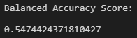
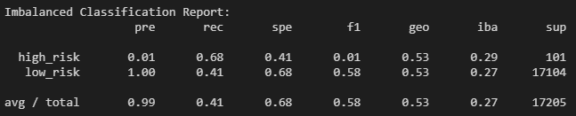
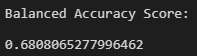
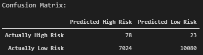
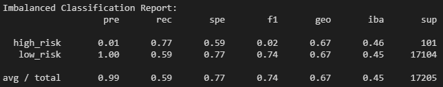
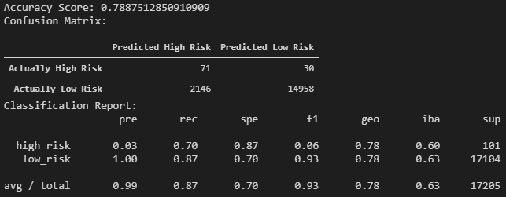
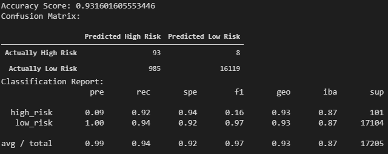

# assess_credit_risk
Build and evaluate several machine learning models to assess credit risk

---
### Use the imbalanced-learn library to resample the data and build and evaluate logistic regression classifiers using the resampled data:
### Summary
A large problem in properly identifying credit risk is that there is an unbalanced classification problem; the number of good "low risk" loans outnumbers the number of risky "high risk" loans. Therefore, the following sampling techniques have been performed on the dataset to train and evaluate machine learning models with unbalanced classes. 

### Random Oversampling
- Through random oversampling, instances of the minority class are randomly selected and added to the training set until the majority and minority classes are balanced.

- Results: 

  - The accuracy score is 66.0%, indicating that each observation in the testing set was predicted correctly about 66% of the time by the model. However, this number can be misleading and additional metrics need to be generated. 
    
    

  - The confusion matrix is displayed below. From the confusion matrix, it can be seen that out of the loan statuses prediced to fall within "high risk", most of them were predicted incorrectly.  
    
    

  - The classification report demonstrates the discrepancies between the model predicting a "low risk" versus "high risk" loan status. Looking at the "low risk", the model has high precision (pre) and low recall (rec). This means that of the loans predicted to be "low risk", the model is reliable for classifying "low risk" loan statuses. However, there is a large number of loans that are being classified as "high risk" but are actually "low risk", as seen in the confusion matrix. 
  
    Now analyzing the "high risk" loan statuses, there is a higher recall but very poor precision. Of the loans that are actually "high risk", there is a 74% likelihood that the model will correctly predict that it is "high risk". However, out of the outcomes where the model predicts that the loan is "high risk", there is an extremely low probability that the laon is actually "high risk". 
    
    

### SMOTE: Synthetic Minority Oversampling Technique
- In SMOTE, new instances are interpolated. For an instance from the minority class, a number of its closest neighbors is chosen. Based on the values of these neighbors, new values are created. 

- Results: 

  - The accuracy score of the Logistic Regression model using the SMOTE oversampling technique yielded a slightly lower value of about 65%.
  
    
  
  - The confusion matrix is displayed below:
  
    
  
  - The recall for the majority class ("low risk") has increased compared to using random oversampling. However, it has decreased for the minority class ("high risk"). The precision has remained the same for both the majority and minority classes. 
  
    The tradeoff is that of the loans that are actually "low risk", more are being correctly classified. On the other hand, more of the "high risk" loans are now incorrectly being identified as "low risk". 
  
    
  
### Cluster Centroid Undersampling
- In cluster centroid undersampling, the algorithm identifies clusters of the majority class, then generates synthetic data points, called centroids, that are representative of the clusters. The majority class is then undersampled down to the size of the minority class. 

- Results: 

  - The accuracy score for the cluster centroid undersampling technique is low at 55% approximately. 
  
    
  
  - Again, the confusion matrix demonstrates that of the loans being classified as "high risk", the majority are actually "low risk". Contrary, the "low risk" loans are correctly being identified when properly predicted.
  
    
    
  - The recall of the majority "low risk" class is the lowest compared to the previous models. This is illustrated by the confusion matrix; the majority of the outcomes have been incorrectly predicted as "high risk".
  
    

### Combination Sampling With SMOTEENN
- SMOTEENN combines the SMOTE and ENN (Edited Nearest Neighbors) algorithms by following a two-step process. First, the minority class is oversampled with SMOTE. Then, the resulting data is cleaned with an undersampling strategy. If the two nearest neighbors of a data point belong to two different classes, that point is dropped. 

- Results: 

  - The accuracy score is highest at about 68% using the SMOTEENN technique. 
  
    
  
  - Compared to the cluster centroid undersampling technique, the model has improved at properly identifying "low risk" loans. 
  
    
    
  - The precision of both the majority and minority class has remained the same for each of the sampling techniques. This indicates that the reliability of a positive classification for a "high risk" loan is low, while the positive classification of a "low risk" loan is high when predicted by the model. 
  
    Looking at the recall scores, there is a 59% likelihood that of the loans that are actually "low risk" are correctly identified. Also, of the actual "high risk" loans, there is a 77% likelihood that the loan will be properly classified. Of all of the sampling techniques, SMOTEENN has resulted in the highest recall for the minority "high risk" class. 
  
    

### Conclusion

Overall, the machine learning models tested would not be recommended. The main goal of the machine learning model would be to properly identify which "high risk" loans. While the recall score of the SMOTEENN technique was the best compared to the other models, the precision is too low at 0.01. The tradeoff between the recall and the precision for the minority class is too great. Although of the actual "high risk" loans, most are being predicted correctly, too many "low risk" loans are being misclassified as "high risk".

---
### Train and compare two different ensemble classifiers to predict loan risk:
### BalancedRandomForestClassifier
- A balanced random forest randomly under-samples each boostrap sample to balance it. 

  (https://imbalanced-learn.readthedocs.io/en/stable/generated/imblearn.ensemble.BalancedRandomForestClassifier.html)

- Results:

  - The BalancedRandomForestClassifier produced an accuracy score of almost 80%. The accuracy of the model is also backed up by its high F1 score for the "low risk" loans. The F1 score, also known as the harmonic mean of the precision and recall, indicates the accuracy of the model. If the model produces a low F1 score, then there is a pronounced imbalance between the precision and recall of the model. In this case, the precision of the model for "low risk" loans is 1.00 and the recall is 0.87. The high precision indicates that if a loan is determined to be "low risk", then there is a very high likelihood that loan will be "low risk". Looking at the confusion matrix, the model predicted a "low risk" loan correctly 14,958 out of 14,988 times. The recall, 0.87, represents that of the 17,104 "low risk" loans, 14,958 of them were predicted correctly. 
  
    However, the F1 score for the "high risk" loans is low yet again, demonstrating the imbalance between the precision and recall of the model. The low precision means that of the loans that were predicted to be "high risk", the majority were actually "low risk". On the other hand, 70% of the actual "high risk" loans were correctly predicted to be "high risk".
    
    

### EasyEnsembleClassifier
- The classifier is an ensemble of AdaBoost learners trained on different balanced boostrap samples. The balancing is achieved by random under-sampling.

  (https://imbalanced-learn.readthedocs.io/en/stable/generated/imblearn.ensemble.EasyEnsembleClassifier.html)

- Results:

  - The EasyEnsembleClassifier resulted in the highest accuracy score of all of the models at about 93%. This is verified by the increase in both precision and recall for both the "low risk" and "high risk" loans.  
    
    

### Conclusion
Both of the ensemble learners tested outperformed the above sampling techniques. The concept of ensemble learning is the process of combining multiple models, like decision tree algorithms, to help improve the accuracy and robustness, as well as decrease variance of the model, and therefore increase the overall performance of the model. The increased model performance can be observed by looking at the accuracy score, confusion matrix, and classification report of each model. 

