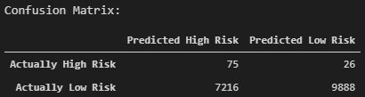

# assess_credit_risk
Build and evaluate several machine learning models to assess credit risk

### Summary

### Random Oversampling
- Through random oversampling, instances of the minority class are randomly selected and added to the training set until the majority and minority classes are balanced.

- Results: 

  - The accuracy score is 66.0%, indicating that each observation in the testing set was predicted correctly about 66% of the time by the model. However, this number can be misleading and additional metrics need to be generated. 
    
    

  - The confusion matrix is displayed below. From the confusion matrix, it can be seen that out of the loan statuses prediced to fall within "high risk", most of them were predicted incorrectly.  
    
    

  - The classification report demonstrates the discrepancies between the model predicting a "low risk" versus "high risk" loan status. Looking at the "low risk", the model has a high precision (pre) and low recall (rec). This means that the model is reliable for classifying "low risk" loan statuses. However, there is a large number of loans that are being classified as "high risk" but are actually "low risk", as seen in the confusion matrix. 
  
    Now analyzing the "high risk" loan statuses, there is a higher recall but very poor precision. Of the loans that are actually "high risk", there is a 74% likelihood that the model will correctly predict that it is "high risk". However, out of the outcomes where the model predicts that the loan is "high risk", there is an extremely low probability that the laon is actually "high risk". 
    
    

### SMOTE: Synthetic Minority Oversampling Technique
- In SMOTE, new instances are interpolated. For an instance from the minority class, a number of its closest neighbors is chosen. Based on the values of these neighbors, new values are created. 

- Results: 

  - The accuracy score of the Logistic Regression model using the SMOTE oversampling technique yielded a slightly lower value of about 65%.
  
    
  
  - The confusion matrix is displayed below:
  
    
  
  - The recall for the majority class ("low risk") has increased compared to using random oversampling. However, it has decreased for the minority class ("high risk"). The precision has remained the same for both the majority and minority classes. 
  
    The tradeoff is that of the loans that are actually "low risk", more are being correctly classified. On the other hand, more of the "high risk" loans are now incorrectly being identified as "low risk". 
  
    
  
### Cluster Centroid Undersampling

### Combination Sampling With SMOTEENN
